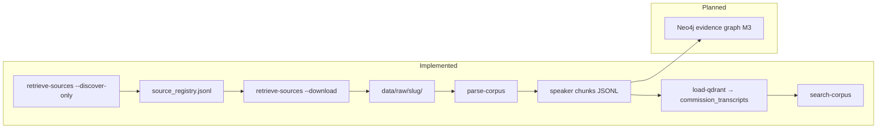

# Getting Started — Source Retrieval, Parsing & Search

Operational guide for discovering, downloading, parsing and semantically
searching commission source artifacts.

## Prerequisites

- [uv](https://docs.astral.sh/uv/) (recommended) or Python 3.12+
- Optional: Docker (reproducible retrieval runs, and the Qdrant/Neo4j stores)
- **No Qdrant or Neo4j required** for source retrieval or parsing — only for
  the semantic-search stage (M2+)

## Setup (uv)

```bash
# From repo root
uv sync --all-packages --all-extras
cp .env.example .env   # optional overrides

# Local Playwright (only needed for Zondo manual-session harvest)
uv run playwright install chromium
```

## Artifact pipeline

| Stage | Status | Command | Output |
|---|---|---|---|
| Discover (Madlanga) | **Implemented + verified** | `uv run retrieve-sources --commission madlanga --discover-only` | `data/sources/source_registry.jsonl` |
| Download (Madlanga) | **Implemented + verified** | `uv run retrieve-sources --commission madlanga --download` | `data/raw/madlanga/` |
| Check for new publications | **Implemented** | `uv run retrieve-sources --commission madlanga --discover-only --write-report` | `reports/source-checks/` |
| Download new only | **Implemented** | `uv run retrieve-sources --commission madlanga --download-new-only --write-report` | registry + `data/raw/` + reports |
| Discover (Zondo bootstrap) | **Implemented, non-authoritative** | `uv run retrieve-sources --commission zondo --zondo-source bootstrap --discover-only` | same registry |
| Download (Zondo bootstrap) | **Implemented** | `uv run retrieve-sources --commission zondo --zondo-source bootstrap --download` | `data/raw/zondo/*.txt` |
| Discover (Zondo official PDFs) | **Blocked (Cloudflare)** | `uv run retrieve-sources --commission zondo --zondo-source official --discover-only` | requires manual session |
| Parse / chunk | **Implemented + verified** | `uv run parse-corpus --commission madlanga` | `data/processed/madlanga/*.jsonl` |
| Corpus statistics | **Implemented + verified** | `uv run corpus-stats --charts` | `data/processed/stats/` |
| Qdrant ingest | **Implemented + verified** | `uv run load-qdrant --commission madlanga` | `commission_transcripts` collection |
| Semantic search | **Implemented + verified** | `uv run search-corpus "query" [--day N] [--speaker LABEL]` | ranked, page-cited hits |
| Neo4j ingest | Planned (M3) | constraints ready: `infra/neo4j/constraints.cypher` | evidence graph |



## Commands

### Madlanga (official site, ~108 transcript PDFs)

```bash
uv run retrieve-sources --commission madlanga --discover-only
uv run retrieve-sources --commission madlanga --download
```

Transcripts are embedded in `hearing.php` as JSON inside `data-tabs` attributes (not plain anchor links).

### Zondo bootstrap (DSFSI plaintext, default)

```bash
uv run retrieve-sources --commission zondo --discover-only
uv run retrieve-sources --commission zondo --download
```

- Source: [dsfsi/project-state-capture](https://github.com/dsfsi/project-state-capture) pinned to commit `e2bc9d9183f2`.
- Licence: **CC-BY-SA-4.0** — attribution required if redistributed.
- Records have `authoritative=false` and `notes` citing the bootstrap provenance.
- Plaintext files have **no page numbers** — the `Document → Page → Chunk` spine cannot be built for this tier when parsing arrives.

### Zondo official PDFs (manual session only)

The official site (`statecapture.org.za`) is behind Cloudflare. Headless Chromium alone does not pass the challenge.

To attempt official PDF discovery:

1. Solve the Cloudflare challenge in a real browser.
2. Export either:
   - `cf_clearance` cookie → `INGEST_ZONDO_CF_COOKIE` in `.env` (short-lived, ~30 min, IP/UA-bound), or
   - Playwright `storage_state` JSON → `INGEST_ZONDO_STORAGE_STATE=/path/outside/repo/state.json`
3. Run:

```bash
uv run retrieve-sources --commission zondo --zondo-source official --discover-only
```

**Do not commit** session files or cookie values.

### Both commissions

```bash
uv run retrieve-sources --commission both --zondo-source bootstrap --download
```

### Check for new publications

Re-run discovery against the live site and compare URLs to the registry. A publication is "new" when its canonical URL is not yet in `source_registry.jsonl`.

```bash
# Discover only — prints New: N in the summary
uv run retrieve-sources --commission madlanga --discover-only

# Discover and write JSON + Markdown reports (even when New: 0)
uv run retrieve-sources --commission madlanga --discover-only --write-report

# Discover, download only newly found records, and write reports
uv run retrieve-sources --commission madlanga --download-new-only --write-report
```

Reports are written to `reports/source-checks/` (gitignored, regenerable). Each run produces a timestamped pair:

- `source-check_YYYYMMDDTHHMMSSZ.json` — machine-readable summary and new-publication list
- `source-check_YYYYMMDDTHHMMSSZ.md` — human-readable summary

**Limitations:**

- New means a newly discovered URL, not a content revision at an existing URL (use `--force` to re-download known URLs).
- Zondo official PDF monitoring requires a manual Cloudflare session; Madlanga and Zondo bootstrap are fully supported.
- No scheduler is included — run manually or wire into cron/CI yourself.

### Makefile shortcuts

```bash
make install
make test
make retrieve-discover COMMISSION=madlanga
make retrieve-download COMMISSION=both ZONDO_SOURCE=bootstrap
make stores-up            # docker compose up -d qdrant neo4j
make neo4j-constraints    # apply infra/neo4j/constraints.cypher
make load-qdrant          # embed + upsert parsed chunks
```

## Semantic search (M2)

Embeds parsed chunks with `BAAI/bge-small-en-v1.5` (384-dim, cosine,
normalised) into the single shared Qdrant collection `commission_transcripts`
(see `docs/qdrant-model.md`), then searches it with payload filters.

```bash
# 1. Start the stores (Qdrant on :6333, Neo4j on :7474/:7687).
#    Neo4j auth comes from $NEO4J_PASSWORD (default: changeme).
docker compose up -d qdrant neo4j

# 2. Apply the graph constraints once (idempotent; needed before M3 ingestion).
docker compose exec -T neo4j cypher-shell -u neo4j -p "${NEO4J_PASSWORD:-changeme}" \
  < infra/neo4j/constraints.cypher

# 3. Embed + load all parsed chunks. Idempotent: a re-run skips documents whose
#    chunks are already in the collection and upserts by deterministic point id
#    (uuid5 of the chunk_id), so it never duplicates points.
uv run load-qdrant --commission madlanga

# 4. Search — every hit prints day, date, page range, speakers, snippet, and
#    the official PDF URL.
uv run search-corpus "disbanding of the political killings task team"
uv run search-corpus "threats against investigators" --day 3
uv run search-corpus "bail decision" --speaker CHAIRPERSON --limit 3
```

The first `load-qdrant` run downloads the embedding model (~130 MB) and embeds
~15k chunks (minutes on Apple Silicon / a recent CPU). Requires the `vector`
extra (installed by `uv sync --all-packages --all-extras`).

## Docker (retrieval only)

Reproducible environment with Playwright 1.49 + Chromium preinstalled.

```bash
docker compose build ingestion
docker compose run --rm ingestion --commission madlanga --discover-only
docker compose run --rm ingestion --commission zondo --zondo-source bootstrap --download
```

Docker reliably runs **Madlanga + Zondo-bootstrap**. It does **not** bypass Zondo official Cloudflare without a mounted manual session.

## Registry

- Path: `data/sources/source_registry.jsonl` (single combined file, versioned in git)
- Dedup: primary key is `url` (canonicalised)
- SHA256 groups duplicate underlying files for review only — URLs are never merged away
- Downloaded PDFs/txt under `data/raw/` are gitignored

## Verification

```bash
make test
head -3 data/sources/source_registry.jsonl
ls data/raw/madlanga/ | head
```

## Known limitations

1. **Zondo official site**: Cloudflare blocks automated access; use bootstrap or manual session.
2. **Zondo bootstrap**: plaintext only, ~147 per-day files in `data/interim/` (not all 399 days as separate files); no page metadata.
3. **Madlanga date parsing**: some filename date formats may parse incorrectly; RECORD PDFs with `YYYYMMDD` are reliable.
4. **Madlanga mixed artefacts**: press releases and notices on index pages may classify as `supporting_document` unless heuristics match.
